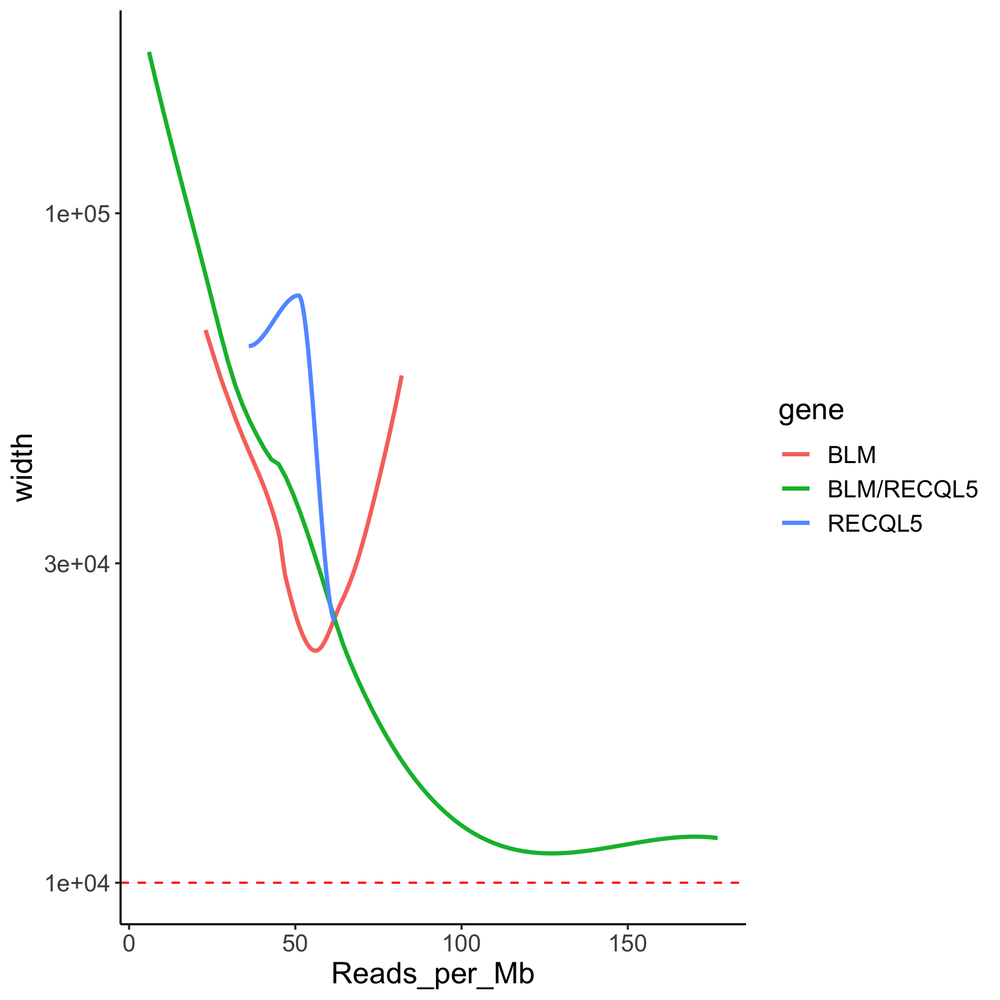

# Breakpointer

#### **Quick Use**

1. Insert all breakpointR RData files in **Input/RData_unfiltered/**

2. Add metrics file(s) to **Input/Metrics/** with `Quality` column that has either `p` for poor libraries or `g` for good libraries

3. Run `sh master.sh` 

5. Collect breakpoints in a tab-separated file from the folder **Output/Breakpoints/** and plots from **Output/Plots/**

  
   
  

